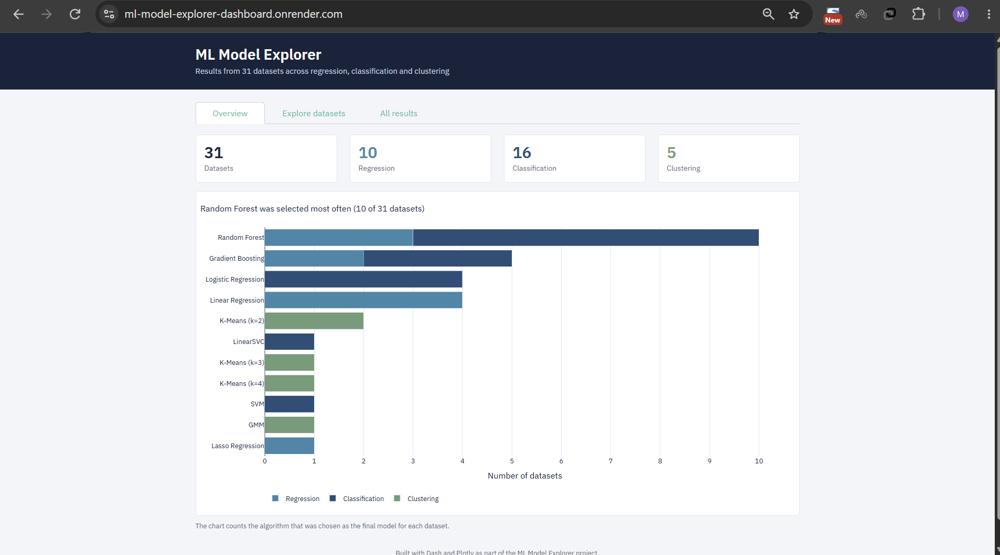
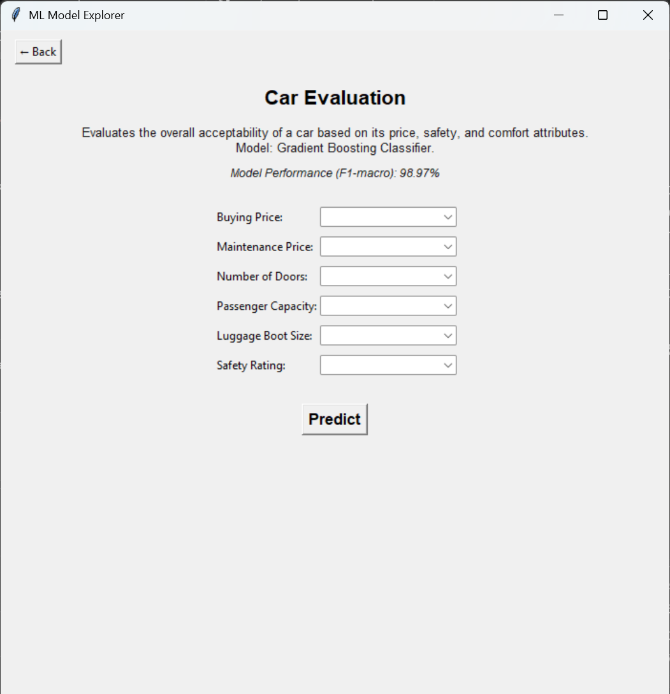

# ML Model Explorer

32 machine learning datasets solved end to end (regression, classification and clustering), a desktop app where you can try every final model, and a web dashboard that summarizes the results.

One of the classification datasets is a text classification task (Amazon Fine Food Reviews sentiment), organized in its own `TextAnalysis` folder for its different preprocessing needs.

**Live dashboard:** https://ml-model-explorer-dashboard.onrender.com/
(hosted on Render's free plan, so the first visit after a quiet period can take about a minute to wake up)

**Dashboard code:** https://github.com/Marjan-bkh/ML_model_explorer_dashboard



## What is in this project

- **A full pipeline for each dataset:** cleaning, exploratory analysis, feature engineering, comparing several models with cross-validation, and choosing a final model.
- **A text classification pipeline:** sentiment prediction from Amazon Fine Food Reviews, shown under Classification in the dashboard.
- **A Tkinter desktop app:** one prediction page per dataset. You type in the feature values and the saved model returns a prediction, with the model's cross-validated score shown on the page.
- **A Dash dashboard:** shows which model was chosen for each dataset, which algorithms won most often, and lets you explore every result.



## How each dataset was handled

1. Explore the data and fix problems (missing values, skewed columns, categorical encoding).
2. Engineer features where the domain suggests it, for example `water_cement_ratio` for concrete strength, or sine/cosine encoding of hour and month for bike rental demand.
3. Compare several models with cross-validation. Cross-validation runs on the training split only, so the test split stays untouched until the final check.
4. Pick the final model. On several datasets I ranked models by the mean minus the standard deviation of their CV score, so that stable models are preferred over lucky ones.
5. Save the model together with its feature names and order (`joblib`), so the desktop app builds inputs in exactly the same way as training.

## What I learned

- **Leakage is easy to miss.** In the daily demand dataset, columns that are components of the target had to be dropped. In the Istanbul stock exchange data, I dropped two columns because of leakage and multicollinearity (one had a VIF of about 22).
- **Time-based data needs time-aware validation.** Room occupancy uses a time-based split, and the stock exchange data uses `TimeSeriesSplit`, instead of random shuffling.
- **Small datasets need cross-validation.** On the echocardiogram data a single small test split gave misleading results. On the heart disease data (237 training rows), logistic regression beat tree models (ROC-AUC 0.906).
- **Feature engineering can matter more than the model.** On blood transfusion, the engineered `Frequency_per_Time` feature became the most important one.
- **A negative result is still a result.** On the Dow Jones index data, even a tuned random forest could not beat predicting the mean (test R² about -0.005). This is consistent with the efficient market hypothesis, so I documented it instead of forcing a better number.

## Notes on the data

- The official Amazon product reviews dataset (about 34 GB) was too large to work with on a personal computer, so the text classification task uses the Kaggle *Amazon Fine Food Reviews* dataset (568,000 reviews) instead.
- Datasets come from the DataScienceDojo dataset series, which uses public sources such as the UCI Machine Learning Repository.

## Tech stack

Python, pandas, scikit-learn, joblib, Tkinter, Dash, Plotly, dash-bootstrap-components, Git and GitHub, Render.

## Project structure
```
DataScienceProject/
├── App/                      # main window, category pages, shared widgets
├── prediction_pages/         # one prediction page per dataset
├── Regression/
│   ├── Datasets/
│   └── ModelsOutcome/          # saved models (.pkl)
├── Classification/
│   ├── Datasets/
│   └── ModelsOutcome/
├── Clustering/
│   ├── Datasets/
│   └── ModelsOutcome/
├── TextAnalysis/            # text classification (Amazon Fine Food Reviews); shown under Classification in the app and dashboard
│   ├── Datasets/
│   └── ModelsOutcome/
├── docs/                       # screenshots used in this README
└── requirements.txt
```

## Run the desktop app
```
git clone https://github.com/Marjan-bkh/DataScienceProject
cd DataScienceProject
pip install -r requirements.txt
python main.py
```

## Author

Marjan Bakhtiari · https://www.linkedin.com/in/marjanbakhtiari/
